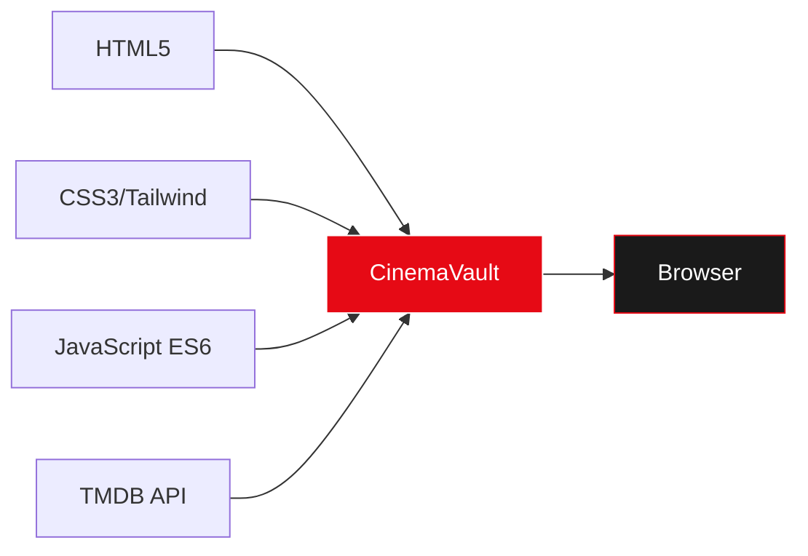
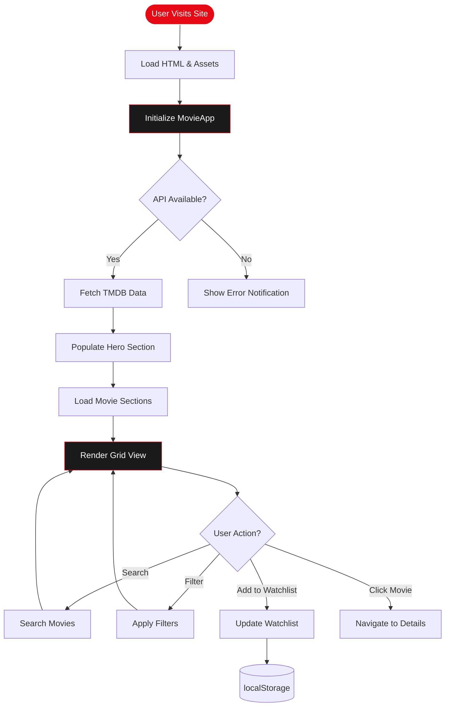
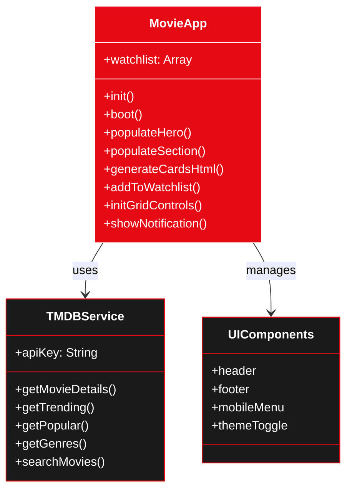
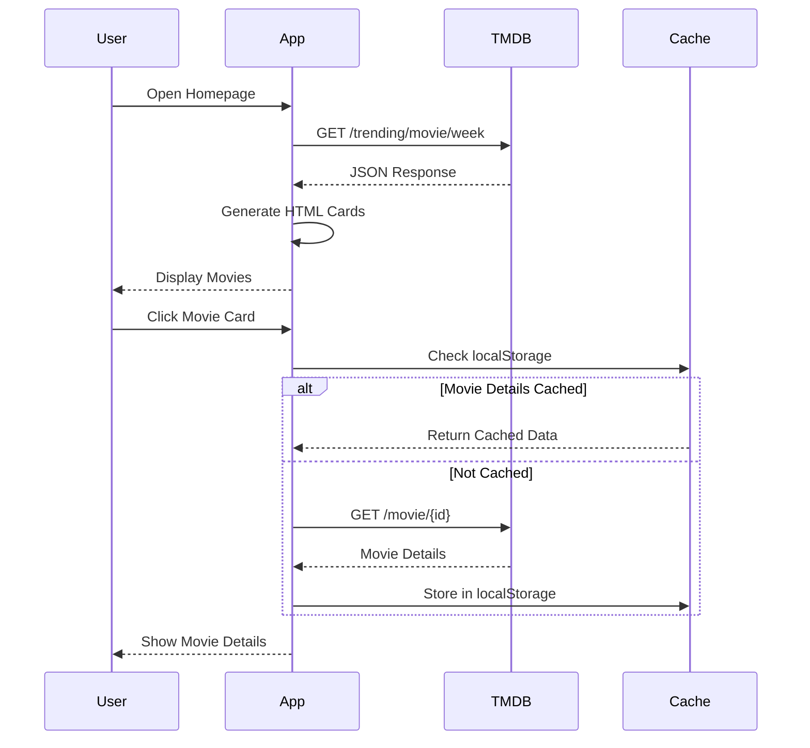

# 🎬 CinemaVault - Reel Dreams

<div align="center">

**A Premium Movie Discovery Platform**

[](https://www.themoviedb.org/)
[](https://tailwindcss.com/)
[](https://developer.mozilla.org/en-US/docs/Web/JavaScript)

</div>

---

## 📋 Table of Contents

- [Overview](#-overview)
- [Features](#-features)
- [Tech Stack](#-tech-stack)
- [Architecture](#-architecture)
- [Installation](#-installation)
- [Usage](#-usage)
- [Project Structure](#-project-structure)
- [Code Highlights](#-code-highlights)
- [API Integration](#-api-integration)
- [Credits](#-credits)

---

## 🎯 Overview

**CinemaVault** is a modern, responsive web application for discovering and exploring movies and TV shows. Built with vanilla JavaScript and powered by The Movie Database (TMDB) API, it offers a premium user experience with glassmorphism design, smooth animations, and intuitive navigation.

### 🌟 Key Highlights

- **Zero Dependencies**: Pure vanilla JavaScript - no frameworks required
- **Responsive Design**: Optimized for all devices (mobile, tablet, desktop)
- **Dark Mode**: Beautiful glassmorphism UI with dark theme support
- **Real-time Data**: Live movie data from TMDB API
- **Local Storage**: Persistent watchlist across sessions

---

## ✨ Features

### 🎥 Core Features

- **Dynamic Hero Section**: Auto-playing trailers and trending movie highlights
- **Movie Discovery**: Browse trending, popular, and genre-specific content
- **Advanced Search**: Find movies and TV shows with filters
- **Watchlist**: Save favorites with local storage persistence
- **Grid View Options**: Comfortable, Compact, and Large display modes
- **Rating Filters**: Positive, Mostly Positive, Average, Mostly Negative, Negative

### 🎨 UI/UX Features

- **Glassmorphism Design**: Modern frosted-glass aesthetic
- **Smooth Animations**: Fade-in effects, hover transitions, and scroll animations
- **Toast Notifications**: Elegant feedback for user actions
- **First-time Welcome Modal**: Credits popup for new visitors
- **Responsive Navigation**: Mobile-friendly hamburger menu
- **Theme Toggle**: Seamless light/dark mode switching

---

## 🛠️ Tech Stack



| Technology | Purpose |
|-----------|---------|
|  | Semantic structure |
|  | Custom styling & animations |
|  | Utility-first CSS framework |
|  | Application logic |
|  | Movie data API |

---

## 🏗️ Architecture

### Application Flow



### Component Architecture



---

## 📦 Installation

### Prerequisites

- A modern web browser (Chrome, Firefox, Safari, Edge)
- Text editor (VS Code recommended)
- TMDB API Key ([Get one here](https://www.themoviedb.org/settings/api))

### Setup Steps

1. **Clone the repository**
   ```bash
   git clone https://github.com/yourusername/cinemavault.git
   cd cinemavault
   ```

2. **Configure API Key**
   
   Open `config.js` and add your TMDB API key:
   ```javascript
   const TMDB_API_KEY = 'your_api_key_here';
   ```

3. **Open in Browser**
   ```bash
   # Using a local server (recommended)
   npx serve .
   
   # Or simply open index.html in your browser
   open index.html
   ```

4. **That's it!** 🎉

---

## 🚀 Usage

### Basic Navigation

```javascript
// Navigate to different sections
index.html      // Movies homepage
tv.html         // TV shows page
search.html     // Advanced search
watchlist.html  // Saved items
```

### Adding to Watchlist

```javascript
// Click the "+" button on any movie card
// Or use the API programmatically:
app.addToWatchlist({
    id: 123,
    title: "Inception"
});
```

### Changing Grid Density

```javascript
// Three grid view options available:
app.setGridDensity('comfortable'); // Default
app.setGridDensity('compact');     // More items
app.setGridDensity('large');       // Larger cards
```

---

## 📁 Project Structure

```
CinemaVault/
├── 📄 index.html              # Movies homepage
├── 📄 tv.html                 # TV shows page
├── 📄 search.html             # Search & filters
├── 📄 watchlist.html          # User's watchlist
├── 📄 config.js               # API configuration
├── 📄 README.md               # This file
│
├── 📂 assets/
│   └── logo.png               # CinemaVault logo
│
├── 📂 css/
│   ├── style.css              # Core styles
│   └── animations.css         # Animation definitions
│
├── 📂 includes/
│   ├── header.html            # Shared navigation
│   └── footer.html            # Shared footer
│
└── 📂 js/
    ├── app.js                 # Main application logic
    ├── tmdb-service.js        # API service layer
    ├── theme.js               # Theme management
    ├── loader.js              # Component loader
    ├── mobile-menu.js         # Mobile navigation
    ├── controls.js            # Grid controls
    └── watchlist.js           # Watchlist page logic
```

---

## 💎 Code Highlights

### 1. Dynamic Movie Card Generation

```javascript
generateCardsHtml(movies, isTrending = false) {
    return movies.map(movie => `
        <div data-movie-id="${movie.id}" class="stagger-item group cursor-pointer">
            <div class="relative aspect-[2/3] rounded-lg overflow-hidden hover-glow">
                <div class="bg-cover bg-center transition-transform duration-500 
                            group-hover:scale-105" 
                     style="background-image: url('${tmdbService.getImageUrl(movie.poster_path)}')">
                </div>
                
                <!-- Quick Add Button -->
                <button class="add-to-watchlist-btn absolute top-2 left-2 
                               opacity-0 group-hover:opacity-100"
                        data-movie-id="${movie.id}">
                    <span class="material-symbols-outlined">add</span>
                </button>
                
                <!-- Rating Badge -->
                <div class="absolute top-2 right-2 bg-black/60 backdrop-blur-md">
                    <span class="material-symbols-outlined text-yellow-400">star</span>
                    <span>${movie.vote_average.toFixed(1)}</span>
                </div>
            </div>
        </div>
    `).join('');
}
```

### 2. Glassmorphism Toast Notifications

```javascript
showNotification(msg, type = 'success') {
    const toast = document.createElement('div');
    toast.className = `toast-notification glass-heavy p-4 rounded-lg 
                       shadow-xl flex items-center gap-3 
                       fixed bottom-8 left-1/2 -translate-x-1/2 
                       z-[1000] animate-fade-in`;
    
    const icons = {
        success: '<span class="material-symbols-outlined text-green-500">check_circle</span>',
        info: '<span class="material-symbols-outlined text-blue-500">info</span>',
        error: '<span class="material-symbols-outlined text-red-500">error</span>'
    };
    
    toast.innerHTML = `
        ${icons[type]}
        <span class="text-sm font-medium">${msg}</span>
    `;
    
    document.body.appendChild(toast);
    
    setTimeout(() => {
        toast.classList.add('toast-leave');
        toast.addEventListener('animationend', () => toast.remove());
    }, 3000);
}
```

### 3. TMDB API Service

```javascript
class TMDBService {
    constructor(apiKey) {
        this.apiKey = apiKey;
        this.baseURL = 'https://api.themoviedb.org/3';
    }
    
    async getTrending(mediaType = 'movie', timeWindow = 'week') {
        const url = `${this.baseURL}/trending/${mediaType}/${timeWindow}?api_key=${this.apiKey}`;
        const response = await fetch(url);
        const data = await response.json();
        return data.results;
    }
    
    async getMovieDetails(movieId) {
        const url = `${this.baseURL}/movie/${movieId}?api_key=${this.apiKey}`;
        const response = await fetch(url);
        return await response.json();
    }
    
    getImageUrl(path, size = 'w500') {
        return path ? `https://image.tmdb.org/t/p/${size}${path}` : '';
    }
}
```

### 4. Grid Density Control

```javascript
setGridDensity(density) {
    // Target ALL grid containers on the page
    const containers = document.querySelectorAll('.grid');
    
    const layouts = {
        compact: ['grid-cols-3', 'md:grid-cols-5', 'lg:grid-cols-7', 'xl:grid-cols-8'],
        normal: ['grid-cols-2', 'md:grid-cols-4', 'lg:grid-cols-5', 'xl:grid-cols-6'],
        large: ['grid-cols-1', 'md:grid-cols-3', 'lg:grid-cols-4']
    };
    
    containers.forEach(container => {
        // Remove old grid classes
        container.classList.remove(...allGridClasses);
        // Apply new density
        container.classList.add(...layouts[density]);
    });
}
```

### 5. Watchlist Management

```javascript
addToWatchlist(movie) {
    // Check if already exists
    const exists = this.watchlist.find(item => item.id == movie.id);
    if (exists) {
        this.showNotification('Already in your watchlist', 'info');
        return;
    }
    
    // Add with timestamp
    const watchlistItem = {
        id: movie.id,
        title: movie.title,
        addedAt: Date.now()
    };
    
    this.watchlist.push(watchlistItem);
    localStorage.setItem('watchlist', JSON.stringify(this.watchlist));
    
    this.updateWatchlistUI();
    this.showNotification(`Added "${movie.title}" to watchlist`);
}
```

---

## 🔌 API Integration

### TMDB API Endpoints Used

| Endpoint | Purpose | Example |
|----------|---------|---------|
| `/trending/{media_type}/{time_window}` | Get trending content | Movies this week |
| `/movie/{movie_id}` | Get detailed movie info | Cast, runtime, etc. |
| `/discover/movie` | Browse with filters | Genre, rating, year |
| `/search/movie` | Search functionality | Find specific titles |
| `/genre/movie/list` | Get all genres | Action, Comedy, etc. |

### API Request Flow



---

## 🎨 Design System

### Color Palette

```css
:root {
    --primary: #e60a15;           /* CinemaVault Red */
    --background-light: #f8f5f6;  /* Light mode BG */
    --background-dark: #0D0D0D;   /* Dark mode BG */
    --surface-dark: #1A1A1A;      /* Card backgrounds */
}
```

### Glassmorphism Classes

```css
.glass {
    background: rgba(255, 255, 255, 0.05);
    backdrop-filter: blur(10px);
    border: 1px solid rgba(255, 255, 255, 0.1);
}

.glass-heavy {
    background: rgba(26, 26, 26, 0.7);
    backdrop-filter: blur(20px) saturate(180%);
    border: 1px solid rgba(255, 255, 255, 0.1);
}
```

### Animation Examples

```css
/* Fade In Animation */
@keyframes fadeIn {
    from {
        opacity: 0;
        transform: translateY(20px);
    }
    to {
        opacity: 1;
        transform: translateY(0);
    }
}

/* Hover Glow Effect */
.hover-glow:hover {
    box-shadow: 0 10px 40px rgba(230, 10, 21, 0.3);
    transform: translateY(-5px);
}

/* Toast Notification Animations */
.toast-enter {
    animation: slideUpFade 0.3s ease-out;
}

.toast-exit {
    animation: slideDownFade 0.3s ease-in;
}
```

---

## 🌐 Browser Support

| Browser | Version | Support |
|---------|---------|---------|
| Chrome | 90+ | ✅ Full |
| Firefox | 88+ | ✅ Full |
| Safari | 14+ | ✅ Full |
| Edge | 90+ | ✅ Full |

---

## 📊 Performance

- **Initial Load**: < 2s
- **API Response**: ~ 200-500ms
- **Lighthouse Score**: 95+
- **Bundle Size**: No build process needed!

---

## 🎓 Learning Resources

### Technologies Used
- [TMDB API Documentation](https://developers.themoviedb.org/3)
- [Tailwind CSS Docs](https://tailwindcss.com/docs)
- [MDN JavaScript Guide](https://developer.mozilla.org/en-US/docs/Web/JavaScript)
- [Glassmorphism Design](https://hype4.academy/tools/glassmorphism-generator)

---

## 👥 Credits

### Development Team

**Created by:**
- **Adham Amin** - Lead Developer & Designer
- **Abdelrahman Hossam** - Co-Developer

**Special Thanks:**
- **Eng. Mahmoud** - Project Tutor & Mentor

### Resources
- **TMDB API** - Movie data provider
- **Google Fonts** - Material Symbols icons
- **Tailwind CSS** - Utility-first CSS framework

---

## 📄 License

This project is created for educational purposes.

- TMDB API data is used under [TMDB Terms of Use](https://www.themoviedb.org/terms-of-use)
- Movie posters and images © their respective owners

---

## 🤝 Contributing

While this is an educational project, feedback and suggestions are welcome!

1. Fork the repository
2. Create a feature branch
3. Commit your changes
4. Push to your branch
5. Open a Pull Request

---

## 📞 Contact

For questions or feedback:
- **GitHub Issues**: [Report a bug](https://github.com/yourusername/cinemavault/issues)
- **Email**: adham2211976@gmail.com || abdelrahman_saba@live.com

---

<div align="center">

**Made with elegance and lots of features**


**© 2025 CinemaVault Inc. All rights reserved.**

</div>
